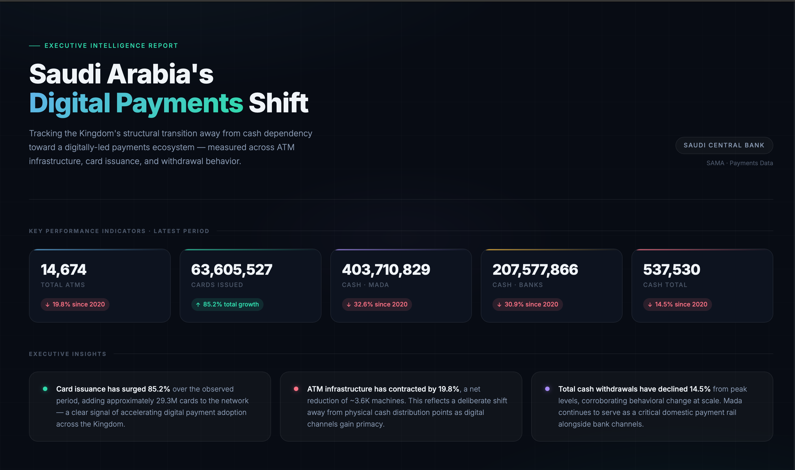

# Saudi Payments Transformation Dashboard

Interactive dashboard analyzing Saudi Arabia’s shift toward digital payments.

## Live Demo
[View Live Dashboard](https://hazzameshal.github.io/saudi-payments-intelligence/)

## Overview
This project visualizes key metrics related to digital payment adoption in Saudi Arabia.

## Key Features
- KPI tracking (growth rate, adoption trends)
- Interactive data visualization
- Clean executive-level dashboard design
- Real-time data integration (API)

## Tools & Technologies
- HTML, CSS, JavaScript  
- Chart.js  
- Google Apps Script (API)
